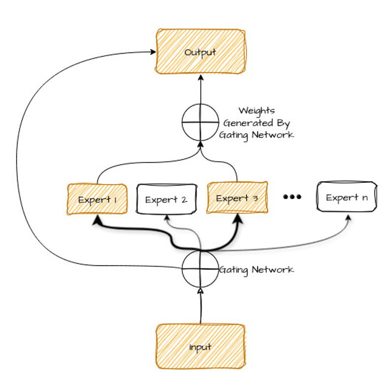
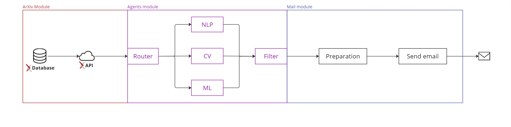

##### Overview

This project is a FastAPI-based API designed to automate the collection of research papers from ArXiv, apply LLM-based agents to review and filter the papers, and then send selected results directly to your email.

##### Philosophical Inspiration: Mixture-of-Experts (MOEs)

The approach draws philosophical inspiration from the Mixture-of-Experts (MOEs) technique, originally proposed by [[Jacobs et al.][1]] in 1991. MOEs optimize computational cost by "dividing and conquering" the problem space. Rather than employing a single, large model, MOEs distribute the task across multiple smaller, specialized models—each referred to as an "expert." These experts focus on specific aspects of the problem, enhancing parameter efficiency and controlling latency, even as the overall model complexity increases.

Though we didn't directly implement MOEs, the core philosophy of using specialized agents to break down tasks informed our design.

##### LLM-Based Agents Approach
Instead of MOEs, we utilized a system of LLM-based agents. But what exactly is an AI agent?

An AI agent is a system capable of reasoning, memory, and task execution. In the context of LLM-based agents, an agent uses a large language model (LLM) to reason through a problem, generate a plan, and execute it by interacting with tools. For this project, we used a specific approach known as Role-Playing Language Agents (RLPA).

##### Role-Playing Language Agents (RLPA)

RLPAs leverage the [emergent capabilities][2] of LLMs to "role-play" as specific characters, experts, or personas. By assigning these roles, LLMs follow instructions and adapt their behavior, much like a theatrical character or a historical figure. This enables LLMs to perform a variety of tasks with flexibility.

[Chen et al.][3] define three main types of RLPAs:

1. **Demographic Persona**: Represents aggregated behaviors and characteristics of specific demographic segments (e.g., occupations, gender, ethnicity).
2. **Character Persona**: Refers to well-established characters, including both real-world figures and fictional entities.
3. **Individualized Persona**: Based on personal profiles and behavioral data unique to specific individuals.

##### Implementation in MARS
In our project, called MARS, we employed Character Personas inspired by renowned researchers to evaluate papers for their coherence with topics such as Natural Language Processing, Computer Vision, and Classical Machine Learning. Each agent reviews papers based on its specialized knowledge.

Additionally, a Router agent, analogous to the router in MOEs, is responsible for directing the papers to the appropriate expert agent and ensuring that only relevant papers are evaluated and sent.

##### References
[1]: <https://ieeexplore.ieee.org/document/6797059> "Adaptative Mixtures of Local Expert"
[2]: <https://en.wikipedia.org/wiki/Emergence> "Emergent Abilities"
[3]: <https://arxiv.org/abs/2404.18231> "From Persona to Personalization: A Survey on Role-Playing Language Agents"

- [1] R. A. Jacobs, M. I. Jordan, S. J. Nowlan and G. E. Hinton, "Adaptive Mixtures of Local Experts," in Neural Computation, vol. 3, no. 1, pp. 79-87, March 1991, doi: 10.1162/neco.1991.3.1.79.
- [2] Refer to the capabilities that arise spontaneously from the complex interactions of simpler components. They are properties that can’t be predicted solely based on the individual parts, but only become apparent when these parts start to interact as a whole. 

- [3] CHEN, Jiangjie et al. From persona to personalization: A survey on role-playing language agents. arXiv preprint arXiv:2404.18231, 2024.